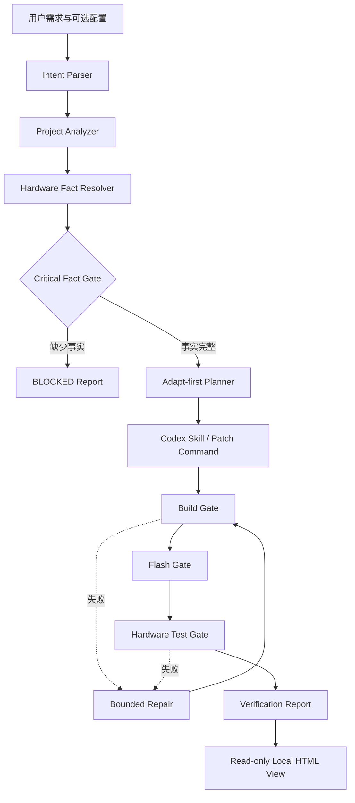

# DriveForge MVP 架构

本文描述 `0.1.x` 的已实现架构。产品长期愿景和完整需求以 [`DriveForge-PRD.md`](../DriveForge-PRD.md) 为准；本文只记录当前代码能够完成的事情。

## 设计目标

DriveForge MVP 围绕四个不变量设计：

1. **Hardware facts are evidence-backed**：硬件相关值必须有用户输入或工程证据。
2. **Adapt first, rewrite last**：优先复用已有实例和官方实现。
3. **Execution is explicit**：构建、烧录和测试阶段分别启用，互不隐式授权。
4. **Verification levels are distinct**：构建通过、烧录通过和硬件验证通过是不同状态。

## 数据流



CLI 负责确定性扫描、门禁、规划、命令执行和报告；根目录的 `SKILL.md` 负责指导 Codex 完成需要工程判断的代码修改。独立运行时也可以通过 `commands.patch` 和 `commands.repair` 接入外部自动化实现器。

## 模块职责

| 模块 | 职责 |
| --- | --- |
| `src/driveforge/cli.py` | 参数解析、配置合并、产物写入和退出码 |
| `src/driveforge/intent.py` | 从中英文需求中识别外设、实例和操作类型 |
| `src/driveforge/analyzer.py` | 扫描 RT-Thread、MCU、构建工具、探针、驱动候选和工程拓扑 |
| `src/driveforge/resolver.py` | 合并项目事实与用户事实，规范化值并执行关键事实门禁 |
| `src/driveforge/planner.py` | 选择参考实例，生成最小改动导向的 Driver Plan |
| `src/driveforge/runner.py` | 执行 patch/build/flash/test/repair 命令，保存日志并计算最终状态 |
| `src/driveforge/viewer.py` | 从真实 JSON 产物生成只读、自包含的本地 HTML 报告 |
| `src/driveforge/models.py` | Fact、Evidence、ScanResult、CommandResult 等领域模型 |
| `src/driveforge/utils.py` | 文件遍历、序列化、哈希基线和变更计算 |
| `playbooks/` | 七类外设的最小硬件验收准则 |
| `schemas/` | 请求、Manifest、Plan、Report 的 JSON Schema |

## Project Analyzer

扫描器只读取文本型工程文件，并忽略 `.git`、`.driveforge`、构建目录、依赖目录和缓存。单次扫描最多处理 5000 个文件，每个文件最大 2 MB，防止意外读取超大生成物。

当前识别内容包括：

- RT-Thread 与版本宏；
- GD32F4、STM32F4 型号与厂商；
- SCons、CMake、Make、west 和 ARM 编译器；
- J-Link、ST-Link、pyOCD 线索；
- 同类外设实例和驱动文件；
- BSP、厂商 SDK、HAL、启动文件、链接脚本、驱动目录、板级配置、Kconfig、SCons、CMake 和 DeviceTree 文件。

扫描结果只是事实候选。用户通过配置提供的值优先级更高，并被标记为 `user_config`，不会与扫描证据混淆。

## Hardware Fact Gate

每个事实包含：

```yaml
value: "PD0"
confidence: "VERIFIED"
source: "project:board_config"
evidence:
  - path: "board.h"
    line: 42
    excerpt: "#define CAN0_RX_PIN PD0"
```

事实置信度为 `VERIFIED`、`HIGH`、`MEDIUM`、`LOW` 或 `UNKNOWN`。关键门禁只接受已解析且置信度不低于 `HIGH` 的事实。各外设的具体要求见 [`configuration.md`](configuration.md)。

以下情况也会阻塞：

- 目标不是 RT-Thread；
- MCU 不属于 GD32F4 或 STM32F4；
- 外设不在 MVP 范围；
- 外设类型与实例名称不一致；
- GPIO 名称不在 `PA0..PK15` 范围；
- 显式提供的时钟频率不是正整数。

## Planning 与 Adapt First

Planner 根据候选文件来源和匹配度进行排序。项目内实现优先于 RTOS BSP，RTOS BSP 优先于厂商 SDK。若存在不同实例，例如目标是 `CAN0` 而项目已有 `CAN1`，计划采用 `adapt_existing_instance`；否则依次进入扩展已有驱动或基于已验证 SDK 证据的新实现策略。

Planner 只产生策略与验收条件，不对厂商代码进行全局字符串替换。具体补丁由 Codex Skill 或显式 `commands.patch` 完成。

## 执行与修复

执行器只运行命令配置中的字符串。对应 CLI 开关未提供时，该阶段记录为 `SKIPPED`：

- `--execute-patch`
- `--execute-build`
- `--execute-flash`
- `--execute-test`

Build 和 Test 可以使用 `commands.repair` 进行有限次数修复。默认最多 2 次，代码强制上限为 10 次。Flash 失败不会自动按代码缺陷处理或反复烧录。

最终状态按照各阶段最后一次结果计算，因此“首次失败、修复后通过”会正确进入通过状态，同时历史失败仍保留在报告中供审计。

## 产物与可追踪性

`plan` 在目标工程中创建源码哈希基线。随后执行 `run` 时，Verification Report 会列出规划之后发生变化的文本文件。构建、烧录、测试和修复命令的标准输出与错误输出分别写入 `.driveforge/logs/`。

YAML 产物便于人工审查，JSON 产物便于后续工具消费。核心实现使用 JSON 兼容的 YAML 子集，从而保持零第三方运行时依赖。

`driveforge view` 只读取 `state.json`、可选的 `verification_report.json` 和日志目录，并在同一产物目录生成 `report.html`。页面不提供执行按钮，不引入服务端，也不改变任何工作流状态。仓库中的 `website/` 是独立的产品演示，不连接 CLI，其预设结果不属于证据链。

## 当前边界

- CLI 本身不包含大模型 API；需要工程判断的补丁由 Codex Skill 或外部命令完成。
- 当前没有内置 J-Link/OpenOCD 参数生成器，探针命令由项目配置提供。
- 没有真实开发板时，只能验证工作流，不能声称目标驱动 `VERIFIED`。
- Linux、Zephyr、FreeRTOS、复杂高速外设和非 Cortex-M 平台不属于当前 MVP。
